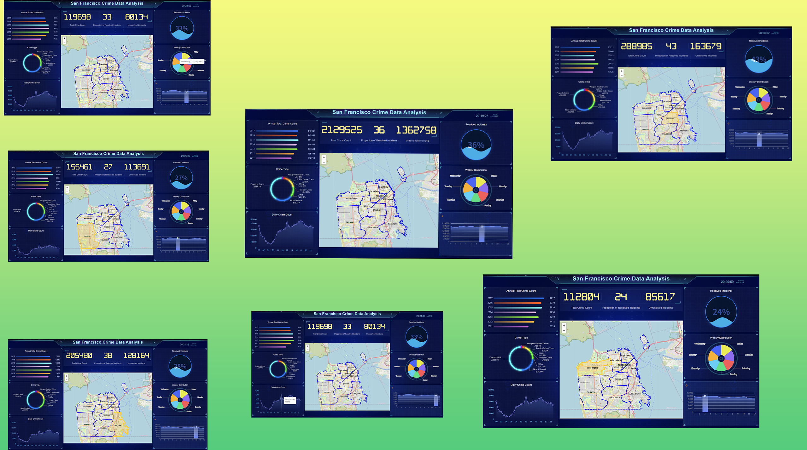

# 🕵️‍♂️ San Francisco Crime Analysis in Apache Spark

This project analyzes a **15-year dataset** of reported crime incidents from the San Francisco Police Department (SFPD), providing key insights into **spatial and temporal crime trends** and developing **crime forecasting models**. 🚓

---

## 🔗 Full Analysis

You can view the **complete data analysis process** by clicking the link below:

📊 [Complete Data Analysis Process](https://databricks-prod-cloudfront.cloud.databricks.com/public/4027ec902e239c93eaaa8714f173bcfc/3132611002490140/2816849201713231/2491725179032020/latest.html)

### 😊Learn more about me:

Welcome to my homepage, feel free to click the link below!

[Click here to visit my homepage](http://guonazhi.site)

---
## 🎥 Demo

Here's a quick look at some of the outputs from the project:

### 1️⃣ **Data Visal WEB**

---
## 🌟 Key Highlights

- 🔍 **In-Depth Crime Analysis**: Uncovered trends in crime over time and across locations using spatial and temporal analysis.
- ⚡ **Big Data Processing**: Built an efficient data pipeline using **Apache Spark RDD, DataFrame**, and **Spark SQL** for large-scale data analysis.
- 📈 **ARIMA Forecasting**: Trained and fine-tuned an **ARIMA model** to predict theft incidents per month, enabling proactive strategies.
- 🗺️ **Visualized Insights**: Created clear and actionable visualizations to highlight crime patterns and hotspots.

---

## 🛠️ Tools & Technologies

- **Apache Spark**: For scalable big data analysis and pipeline creation.
- **ARIMA Model**: For time-series crime forecasting.
- **Visualization Libraries**: To present spatial and temporal patterns clearly.

---

## 🚀 Project Outcomes

- 📌 Identified high-risk areas (e.g., Southern, Mission, Northern districts) and peak crime times (midday and evening hours).  
- 🕒 Revealed safe hours for travel (4–6 AM) and trends showing higher crime rates during daylight saving time.  
- 🛡️ Recommended focused patrols in high-crime districts and during peak times.  
- ✅ Demonstrated expertise in **big data analytics**, **predictive modeling**, and **data visualization** for real-world problems.

---

## 🔮 Future Enhancements

- 🤖 Add **machine learning models** for better predictions.
- 🌐 Incorporate **external data sources** (e.g., weather, events) to improve analysis.
- ⏱️ Deploy as a **real-time crime analysis system** with alerting features.

---
## And You Can See the Demo at here

